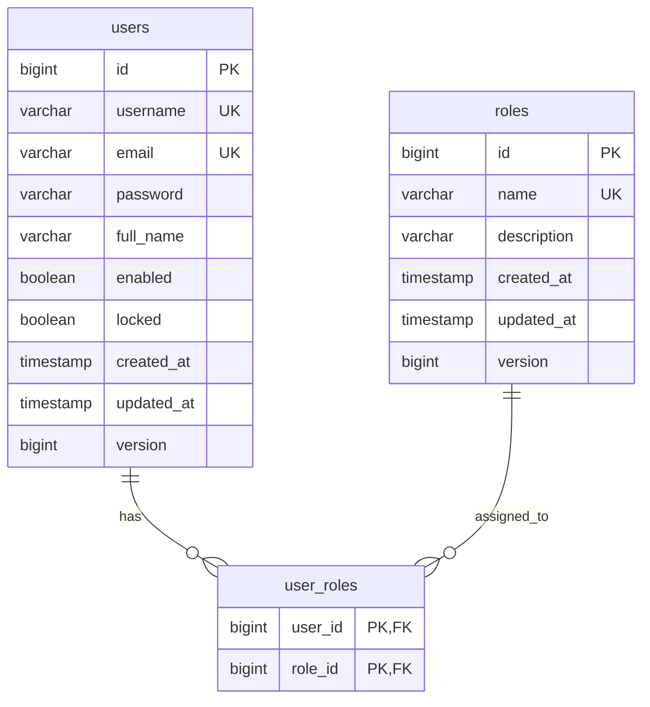
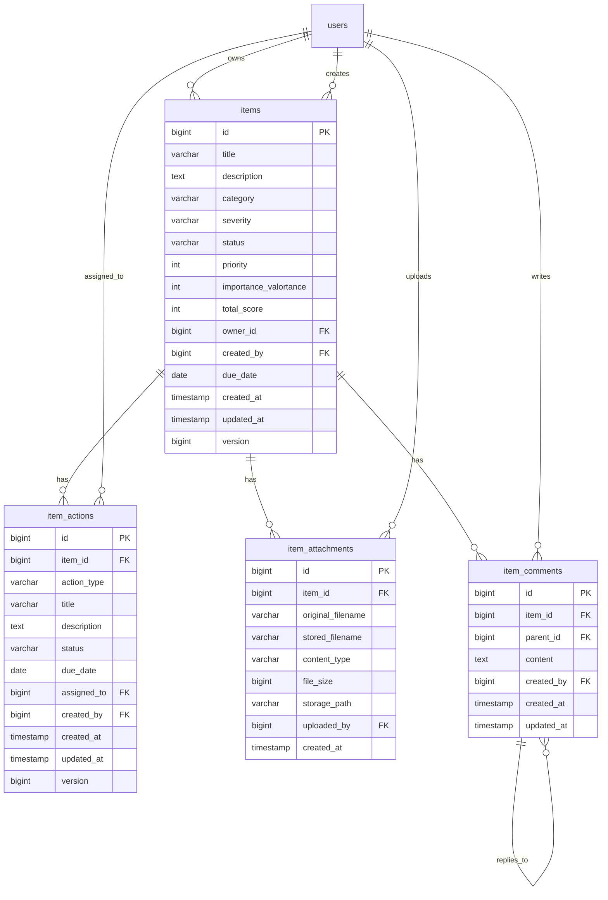
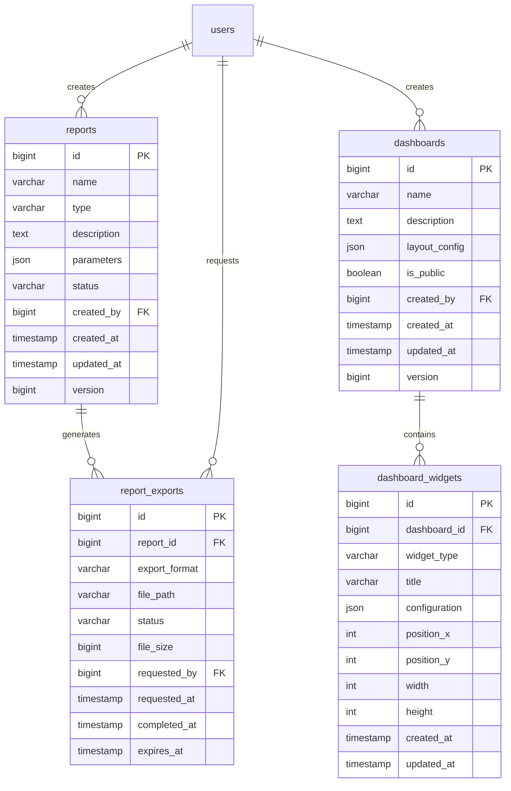
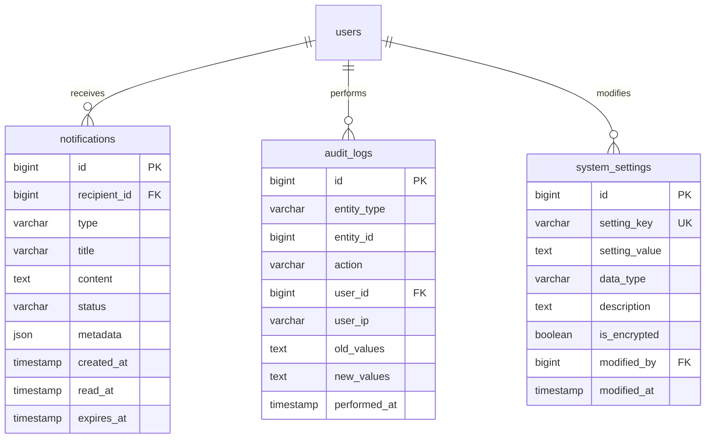
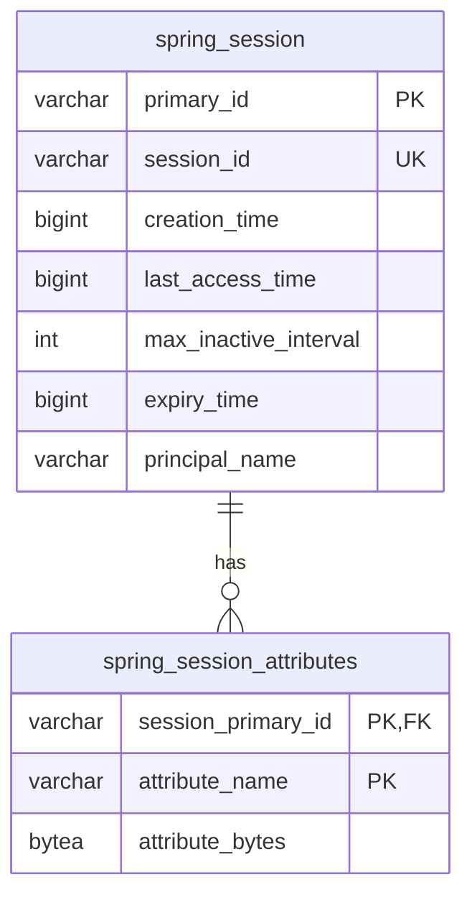

# 🗄️ RSMS Database Design

**PostgreSQL 기반 데이터베이스 설계 및 스키마 문서**

---

## 📋 목차

1. [데이터베이스 개요](#데이터베이스-개요)
2. [ERD 및 관계 설계](#erd-및-관계-설계)
3. [테이블 설계](#테이블-설계)
4. [인덱스 전략](#인덱스-전략)
5. [제약조건](#제약조건)
6. [마이그레이션 전략](#마이그레이션-전략)
7. [성능 최적화](#성능-최적화)
8. [백업 및 복구](#백업-및-복구)

---

## 데이터베이스 개요

### 기술 스펙
```yaml
Database: PostgreSQL 17.6
Connection Pool: HikariCP
Migration Tool: Flyway
Session Storage: Database-based (Spring Session)
Monitoring: PostgreSQL Statistics
```

### 설계 원칙
- **정규화**: 3NF까지 정규화, 필요시 성능을 위한 반정규화 적용
- **일관성**: ACID 트랜잭션 보장
- **확장성**: 파티셔닝과 인덱싱을 통한 성능 확장
- **감사**: 모든 주요 테이블에 Audit 필드 포함
- **소프트 삭제**: 중요 데이터는 논리적 삭제로 보존

### 연결 정보 (WSL 환경)
```yaml
Host: 172.21.174.2
Port: 5432
Database: postgres
Username: postgres
Password: 1q2w3e4r!
Timezone: Asia/Seoul
Charset: UTF-8
```

---

## ERD 및 관계 설계

### 도메인별 테이블 그룹

#### 1. 사용자 관리 (User Management)


#### 2. 엔터티 관리 (Entity Management) - 핵심 도메인


#### 3. 보고서 및 대시보드 (Reporting & Analytics)


#### 4. 알림 및 감사 (Notification & Audit)


#### 5. 세션 관리 (Session Management)


---

## 테이블 설계

### 1. 사용자 관리 테이블

#### users 테이블
```sql
CREATE TABLE users (
    -- Primary Key
    id                  BIGSERIAL PRIMARY KEY,
    
    -- 기본 정보
    username            VARCHAR(50) NOT NULL UNIQUE,
    email               VARCHAR(100) NOT NULL UNIQUE,
    password            VARCHAR(255) NOT NULL,        -- BCrypt 해시
    full_name           VARCHAR(100),
    
    -- 계정 상태
    enabled             BOOLEAN NOT NULL DEFAULT TRUE,
    locked              BOOLEAN NOT NULL DEFAULT FALSE,
    password_expired    BOOLEAN NOT NULL DEFAULT FALSE,
    account_expired     BOOLEAN NOT NULL DEFAULT FALSE,
    
    -- 메타데이터
    last_login_at       TIMESTAMP,
    login_failure_count INTEGER DEFAULT 0,
    locked_at           TIMESTAMP,
    
    -- Audit 필드
    created_at          TIMESTAMP NOT NULL DEFAULT CURRENT_TIMESTAMP,
    updated_at          TIMESTAMP NOT NULL DEFAULT CURRENT_TIMESTAMP,
    created_by          VARCHAR(50),
    updated_by          VARCHAR(50),
    version             BIGINT NOT NULL DEFAULT 0,
    
    -- 소프트 삭제
    deleted             BOOLEAN NOT NULL DEFAULT FALSE,
    deleted_at          TIMESTAMP,
    deleted_by          VARCHAR(50),
    
    -- 제약조건
    CONSTRAINT chk_users_username CHECK (LENGTH(username) >= 3),
    CONSTRAINT chk_users_email CHECK (email ~* '^[A-Za-z0-9._%+-]+@[A-Za-z0-9.-]+\.[A-Z|a-z]{2,}$'),
    CONSTRAINT chk_users_full_name CHECK (LENGTH(full_name) >= 2)
);

-- 인덱스
CREATE INDEX idx_users_username ON users(username) WHERE deleted = FALSE;
CREATE INDEX idx_users_email ON users(email) WHERE deleted = FALSE;
CREATE INDEX idx_users_enabled ON users(enabled);
CREATE INDEX idx_users_last_login ON users(last_login_at DESC);
CREATE INDEX idx_users_created_at ON users(created_at DESC);

-- 트리거 (updated_at 자동 업데이트)
CREATE OR REPLACE FUNCTION update_updated_at_column()
RETURNS TRIGGER AS $$
BEGIN
    NEW.updated_at = CURRENT_TIMESTAMP;
    RETURN NEW;
END;
$$ LANGUAGE plpgsql;

CREATE TRIGGER trigger_users_updated_at
    BEFORE UPDATE ON users
    FOR EACH ROW
    EXECUTE FUNCTION update_updated_at_column();
```

#### roles 테이블
```sql
CREATE TABLE roles (
    id          BIGSERIAL PRIMARY KEY,
    name        VARCHAR(50) NOT NULL UNIQUE,
    description VARCHAR(200),
    
    -- 권한 레벨
    level       INTEGER NOT NULL DEFAULT 1,
    
    -- Audit 필드
    created_at  TIMESTAMP NOT NULL DEFAULT CURRENT_TIMESTAMP,
    updated_at  TIMESTAMP NOT NULL DEFAULT CURRENT_TIMESTAMP,
    version     BIGINT NOT NULL DEFAULT 0,
    
    -- 제약조건
    CONSTRAINT chk_roles_name CHECK (name ~ '^[A-Z_]+$'),
    CONSTRAINT chk_roles_level CHECK (level > 0)
);

-- 기본 데이터
INSERT INTO roles (name, description, level) VALUES 
    ('ADMIN', '시스템 관리자', 100),
    ('ITEM_MANAGER', '아이템 관리자', 50),
    ('USER', '일반 사용자', 10)
ON CONFLICT (name) DO NOTHING;
```

#### user_roles 테이블 (다대다 관계)
```sql
CREATE TABLE user_roles (
    user_id     BIGINT NOT NULL,
    role_id     BIGINT NOT NULL,
    
    -- 할당 정보
    assigned_at TIMESTAMP NOT NULL DEFAULT CURRENT_TIMESTAMP,
    assigned_by BIGINT,
    expires_at  TIMESTAMP,
    
    -- Primary Key
    PRIMARY KEY (user_id, role_id),
    
    -- Foreign Keys
    CONSTRAINT fk_user_roles_user FOREIGN KEY (user_id) 
        REFERENCES users(id) ON DELETE CASCADE,
    CONSTRAINT fk_user_roles_role FOREIGN KEY (role_id) 
        REFERENCES roles(id) ON DELETE CASCADE,
    CONSTRAINT fk_user_roles_assigned_by FOREIGN KEY (assigned_by) 
        REFERENCES users(id)
);

-- 인덱스
CREATE INDEX idx_user_roles_user_id ON user_roles(user_id);
CREATE INDEX idx_user_roles_role_id ON user_roles(role_id);
CREATE INDEX idx_user_roles_expires_at ON user_roles(expires_at) WHERE expires_at IS NOT NULL;
```

### 2. 엔터티 관리 테이블 (핵심 도메인)

#### items 테이블
```sql
CREATE TABLE items (
    -- Primary Key
    id              BIGSERIAL PRIMARY KEY,
    
    -- 기본 정보
    title           VARCHAR(200) NOT NULL,
    description     TEXT,
    
    -- 분류 및 상태
    category        VARCHAR(50) NOT NULL,
    severity        VARCHAR(20) NOT NULL DEFAULT 'MEDIUM',
    status          VARCHAR(20) NOT NULL DEFAULT 'IDENTIFIED',
    
    -- 우선순위 평가
    priority        INTEGER CHECK (priority >= 1 AND priority <= 5),
    importance_valortance      INTEGER CHECK (importance_valortance >= 1 AND importance_valortance <= 5),
    total_score     INTEGER GENERATED ALWAYS AS (priority * importance_valortance) STORED,
    score_level     VARCHAR(20) GENERATED ALWAYS AS (
        CASE 
            WHEN priority * importance_valortance >= 20 THEN 'CRITICAL'
            WHEN priority * importance_valortance >= 15 THEN 'HIGH'
            WHEN priority * importance_valortance >= 10 THEN 'MEDIUM'
            WHEN priority * importance_valortance >= 5 THEN 'LOW'
            ELSE 'MINIMAL'
        END
    ) STORED,
    
    -- 관계 필드
    owner_id        BIGINT,
    created_by      BIGINT NOT NULL,
    
    -- 일정 관리
    due_date        DATE,
    resolved_at     TIMESTAMP,
    
    -- 메타데이터
    visibility      VARCHAR(20) DEFAULT 'INTERNAL', -- PUBLIC, INTERNAL, PRIVATE
    tags            TEXT[],
    metadata        JSONB,
    
    -- Audit 필드
    created_at      TIMESTAMP NOT NULL DEFAULT CURRENT_TIMESTAMP,
    updated_at      TIMESTAMP NOT NULL DEFAULT CURRENT_TIMESTAMP,
    version         BIGINT NOT NULL DEFAULT 0,
    
    -- 소프트 삭제
    deleted         BOOLEAN NOT NULL DEFAULT FALSE,
    deleted_at      TIMESTAMP,
    deleted_by      BIGINT,
    
    -- Foreign Keys
    CONSTRAINT fk_items_owner FOREIGN KEY (owner_id) 
        REFERENCES users(id),
    CONSTRAINT fk_items_creator FOREIGN KEY (created_by) 
        REFERENCES users(id) ON DELETE RESTRICT,
    
    -- 제약조건
    CONSTRAINT chk_items_category CHECK (category IN (
        'OPERATIONAL', 'TECHNICAL', 'FINANCIAL', 
        'STRATEGIC', 'COMPLIANCE', 'SECURITY'
    )),
    CONSTRAINT chk_items_severity CHECK (severity IN (
        'CRITICAL', 'HIGH', 'MEDIUM', 'LOW'
    )),
    CONSTRAINT chk_items_status CHECK (status IN (
        'IDENTIFIED', 'ASSESSED', 'IN_PROGRESS', 
        'MONITORING', 'COMPLETED', 'CLOSED'
    )),
    CONSTRAINT chk_items_visibility CHECK (visibility IN (
        'PUBLIC', 'INTERNAL', 'PRIVATE'
    )),
    CONSTRAINT chk_items_due_date CHECK (due_date >= CURRENT_DATE),
    CONSTRAINT chk_items_resolved_at CHECK (
        (status = 'COMPLETED' AND resolved_at IS NOT NULL) OR
        (status != 'COMPLETED' AND resolved_at IS NULL)
    )
);

-- 인덱스 전략
CREATE INDEX idx_items_status ON items(status) WHERE deleted = FALSE;
CREATE INDEX idx_items_category ON items(category) WHERE deleted = FALSE;
CREATE INDEX idx_items_severity ON items(severity) WHERE deleted = FALSE;
CREATE INDEX idx_items_total_score ON items(total_score DESC) WHERE deleted = FALSE;
CREATE INDEX idx_items_score_level ON items(score_level) WHERE deleted = FALSE;
CREATE INDEX idx_items_owner_id ON items(owner_id) WHERE deleted = FALSE;
CREATE INDEX idx_items_created_by ON items(created_by) WHERE deleted = FALSE;
CREATE INDEX idx_items_created_at ON items(created_at DESC) WHERE deleted = FALSE;
CREATE INDEX idx_items_due_date ON items(due_date ASC) WHERE due_date IS NOT NULL AND deleted = FALSE;
CREATE INDEX idx_items_tags ON items USING GIN(tags) WHERE deleted = FALSE;
CREATE INDEX idx_items_metadata ON items USING GIN(metadata) WHERE deleted = FALSE;

-- 복합 인덱스 (자주 사용되는 쿼리 조건)
CREATE INDEX idx_items_category_status ON items(category, status) WHERE deleted = FALSE;
CREATE INDEX idx_items_owner_status ON items(owner_id, status) WHERE deleted = FALSE;
CREATE INDEX idx_items_score_created ON items(total_score DESC, created_at DESC) WHERE deleted = FALSE;

-- 부분 인덱스 (특정 조건)
CREATE INDEX idx_items_high_priority ON items(total_score DESC, created_at DESC) 
    WHERE total_score >= 15 AND deleted = FALSE;
CREATE INDEX idx_items_overdue ON items(due_date ASC) 
    WHERE due_date < CURRENT_DATE AND status NOT IN ('COMPLETED', 'CLOSED') AND deleted = FALSE;

-- 트리거 생성
CREATE TRIGGER trigger_items_updated_at
    BEFORE UPDATE ON items
    FOR EACH ROW
    EXECUTE FUNCTION update_updated_at_column();
```

#### item_actions 테이블
```sql
CREATE TABLE item_actions (
    -- Primary Key
    id              BIGSERIAL PRIMARY KEY,
    
    -- 연관 관계
    item_id         BIGINT NOT NULL,
    
    -- 액션 정보
    action_type     VARCHAR(20) NOT NULL DEFAULT 'MITIGATE',
    title           VARCHAR(200) NOT NULL,
    description     TEXT,
    
    -- 상태 및 일정
    status          VARCHAR(20) NOT NULL DEFAULT 'PLANNED',
    priority        VARCHAR(10) DEFAULT 'MEDIUM',
    due_date        DATE,
    completed_at    TIMESTAMP,
    
    -- 담당자 정보
    assigned_to     BIGINT,
    created_by      BIGINT NOT NULL,
    
    -- 진행률 및 예상 효과
    progress        INTEGER DEFAULT 0 CHECK (progress >= 0 AND progress <= 100),
    expected_importance_valortance INTEGER CHECK (expected_importance_valortance >= 1 AND expected_importance_valortance <= 5),
    actual_importance_valortance   INTEGER CHECK (actual_importance_valortance >= 1 AND actual_importance_valortance <= 5),
    
    -- 비용 정보
    estimated_cost  DECIMAL(15,2),
    actual_cost     DECIMAL(15,2),
    currency        VARCHAR(3) DEFAULT 'KRW',
    
    -- Audit 필드
    created_at      TIMESTAMP NOT NULL DEFAULT CURRENT_TIMESTAMP,
    updated_at      TIMESTAMP NOT NULL DEFAULT CURRENT_TIMESTAMP,
    version         BIGINT NOT NULL DEFAULT 0,
    
    -- 소프트 삭제
    deleted         BOOLEAN NOT NULL DEFAULT FALSE,
    deleted_at      TIMESTAMP,
    deleted_by      BIGINT,
    
    -- Foreign Keys
    CONSTRAINT fk_item_actions_item FOREIGN KEY (item_id) 
        REFERENCES items(id) ON DELETE CASCADE,
    CONSTRAINT fk_item_actions_assignee FOREIGN KEY (assigned_to) 
        REFERENCES users(id),
    CONSTRAINT fk_item_actions_creator FOREIGN KEY (created_by) 
        REFERENCES users(id) ON DELETE RESTRICT,
    
    -- 제약조건
    CONSTRAINT chk_item_actions_type CHECK (action_type IN (
        'IMPLEMENT', 'REVIEW', 'UPDATE', 'APPROVE', 'MONITOR'
    )),
    CONSTRAINT chk_item_actions_status CHECK (status IN (
        'PLANNED', 'IN_PROGRESS', 'COMPLETED', 'CANCELLED', 'ON_HOLD'
    )),
    CONSTRAINT chk_item_actions_priority CHECK (priority IN (
        'CRITICAL', 'HIGH', 'MEDIUM', 'LOW'
    )),
    CONSTRAINT chk_item_actions_due_date CHECK (due_date >= CURRENT_DATE),
    CONSTRAINT chk_item_actions_completed CHECK (
        (status = 'COMPLETED' AND completed_at IS NOT NULL AND progress = 100) OR
        (status != 'COMPLETED')
    ),
    CONSTRAINT chk_item_actions_cost CHECK (
        estimated_cost >= 0 AND 
        (actual_cost IS NULL OR actual_cost >= 0)
    )
);

-- 인덱스
CREATE INDEX idx_item_actions_item_id ON item_actions(item_id) WHERE deleted = FALSE;
CREATE INDEX idx_item_actions_assigned_to ON item_actions(assigned_to) WHERE deleted = FALSE;
CREATE INDEX idx_item_actions_status ON item_actions(status) WHERE deleted = FALSE;
CREATE INDEX idx_item_actions_due_date ON item_actions(due_date ASC) WHERE due_date IS NOT NULL AND deleted = FALSE;
CREATE INDEX idx_item_actions_priority ON item_actions(priority) WHERE deleted = FALSE;
CREATE INDEX idx_item_actions_progress ON item_actions(progress) WHERE deleted = FALSE;

-- 복합 인덱스
CREATE INDEX idx_item_actions_item_status ON item_actions(item_id, status) WHERE deleted = FALSE;
CREATE INDEX idx_item_actions_assignee_status ON item_actions(assigned_to, status) WHERE deleted = FALSE;

-- 트리거
CREATE TRIGGER trigger_item_actions_updated_at
    BEFORE UPDATE ON item_actions
    FOR EACH ROW
    EXECUTE FUNCTION update_updated_at_column();
```

#### item_attachments 테이블
```sql
CREATE TABLE item_attachments (
    id                  BIGSERIAL PRIMARY KEY,
    item_id             BIGINT NOT NULL,
    
    -- 파일 정보
    original_filename   VARCHAR(255) NOT NULL,
    stored_filename     VARCHAR(255) NOT NULL UNIQUE,
    content_type        VARCHAR(100) NOT NULL,
    file_size           BIGINT NOT NULL,
    storage_path        VARCHAR(500) NOT NULL,
    
    -- 파일 메타데이터
    checksum            VARCHAR(64), -- SHA-256 해시
    is_encrypted        BOOLEAN DEFAULT FALSE,
    
    -- 업로드 정보
    uploaded_by         BIGINT NOT NULL,
    upload_ip           INET,
    
    -- Audit 필드
    created_at          TIMESTAMP NOT NULL DEFAULT CURRENT_TIMESTAMP,
    
    -- 소프트 삭제
    deleted             BOOLEAN NOT NULL DEFAULT FALSE,
    deleted_at          TIMESTAMP,
    deleted_by          BIGINT,
    
    -- Foreign Keys
    CONSTRAINT fk_item_attachments_item FOREIGN KEY (item_id) 
        REFERENCES items(id) ON DELETE CASCADE,
    CONSTRAINT fk_item_attachments_uploader FOREIGN KEY (uploaded_by) 
        REFERENCES users(id) ON DELETE RESTRICT,
    
    -- 제약조건
    CONSTRAINT chk_item_attachments_file_size CHECK (file_size > 0 AND file_size <= 52428800), -- 50MB 제한
    CONSTRAINT chk_item_attachments_content_type CHECK (
        content_type IN (
            'application/pdf', 'application/msword', 
            'application/vnd.openxmlformats-officedocument.wordprocessingml.document',
            'application/vnd.ms-excel', 
            'application/vnd.openxmlformats-officedocument.spreadsheetml.sheet',
            'image/jpeg', 'image/png', 'image/gif', 'text/plain'
        )
    )
);

-- 인덱스
CREATE INDEX idx_item_attachments_item_id ON item_attachments(item_id) WHERE deleted = FALSE;
CREATE INDEX idx_item_attachments_uploaded_by ON item_attachments(uploaded_by) WHERE deleted = FALSE;
CREATE INDEX idx_item_attachments_created_at ON item_attachments(created_at DESC) WHERE deleted = FALSE;
CREATE UNIQUE INDEX idx_item_attachments_stored_filename ON item_attachments(stored_filename) WHERE deleted = FALSE;
```

#### item_comments 테이블
```sql
CREATE TABLE item_comments (
    id          BIGSERIAL PRIMARY KEY,
    item_id     BIGINT NOT NULL,
    parent_id   BIGINT, -- 대댓글 지원
    
    -- 댓글 내용
    content     TEXT NOT NULL,
    
    -- 댓글 메타데이터
    is_internal BOOLEAN DEFAULT TRUE, -- 내부용/외부 공개용 구분
    
    -- 작성자 정보
    created_by  BIGINT NOT NULL,
    
    -- Audit 필드
    created_at  TIMESTAMP NOT NULL DEFAULT CURRENT_TIMESTAMP,
    updated_at  TIMESTAMP NOT NULL DEFAULT CURRENT_TIMESTAMP,
    
    -- 소프트 삭제
    deleted     BOOLEAN NOT NULL DEFAULT FALSE,
    deleted_at  TIMESTAMP,
    deleted_by  BIGINT,
    
    -- Foreign Keys
    CONSTRAINT fk_item_comments_item FOREIGN KEY (item_id) 
        REFERENCES items(id) ON DELETE CASCADE,
    CONSTRAINT fk_item_comments_parent FOREIGN KEY (parent_id) 
        REFERENCES item_comments(id) ON DELETE CASCADE,
    CONSTRAINT fk_item_comments_creator FOREIGN KEY (created_by) 
        REFERENCES users(id) ON DELETE RESTRICT,
    
    -- 제약조건
    CONSTRAINT chk_item_comments_content CHECK (LENGTH(TRIM(content)) >= 1),
    CONSTRAINT chk_item_comments_no_self_parent CHECK (id != parent_id)
);

-- 인덱스
CREATE INDEX idx_item_comments_item_id ON item_comments(item_id) WHERE deleted = FALSE;
CREATE INDEX idx_item_comments_parent_id ON item_comments(parent_id) WHERE deleted = FALSE;
CREATE INDEX idx_item_comments_created_by ON item_comments(created_by) WHERE deleted = FALSE;
CREATE INDEX idx_item_comments_created_at ON item_comments(created_at DESC) WHERE deleted = FALSE;

-- 복합 인덱스
CREATE INDEX idx_item_comments_item_created ON item_comments(item_id, created_at DESC) WHERE deleted = FALSE;

-- 트리거
CREATE TRIGGER trigger_item_comments_updated_at
    BEFORE UPDATE ON item_comments
    FOR EACH ROW
    EXECUTE FUNCTION update_updated_at_column();
```

### 3. 알림 시스템

#### notifications 테이블
```sql
CREATE TABLE notifications (
    id              BIGSERIAL PRIMARY KEY,
    
    -- 수신자 정보
    recipient_id    BIGINT NOT NULL,
    
    -- 알림 내용
    type            VARCHAR(50) NOT NULL,
    title           VARCHAR(200) NOT NULL,
    content         TEXT,
    
    -- 상태 관리
    status          VARCHAR(20) DEFAULT 'UNREAD',
    priority        VARCHAR(10) DEFAULT 'NORMAL',
    
    -- 추가 데이터
    metadata        JSONB,
    
    -- 관련 리소스
    related_entity_type VARCHAR(50),
    related_entity_id   BIGINT,
    
    -- 일정 관리
    created_at      TIMESTAMP NOT NULL DEFAULT CURRENT_TIMESTAMP,
    read_at         TIMESTAMP,
    expires_at      TIMESTAMP,
    
    -- Foreign Keys
    CONSTRAINT fk_notifications_recipient FOREIGN KEY (recipient_id) 
        REFERENCES users(id) ON DELETE CASCADE,
    
    -- 제약조건
    CONSTRAINT chk_notifications_type CHECK (type IN (
        'ITEM_CREATED', 'ITEM_UPDATED', 'ITEM_ASSIGNED', 
        'ITEM_HIGH_SCORE', 'ITEM_OVERDUE', 'ACTION_DUE',
        'SYSTEM_NOTICE', 'USER_MENTION'
    )),
    CONSTRAINT chk_notifications_status CHECK (status IN (
        'UNREAD', 'READ', 'ARCHIVED'
    )),
    CONSTRAINT chk_notifications_priority CHECK (priority IN (
        'URGENT', 'HIGH', 'NORMAL', 'LOW'
    )),
    CONSTRAINT chk_notifications_read_status CHECK (
        (status = 'READ' AND read_at IS NOT NULL) OR
        (status != 'read')
    )
);

-- 인덱스
CREATE INDEX idx_notifications_recipient ON notifications(recipient_id);
CREATE INDEX idx_notifications_status ON notifications(status);
CREATE INDEX idx_notifications_type ON notifications(type);
CREATE INDEX idx_notifications_created_at ON notifications(created_at DESC);
CREATE INDEX idx_notifications_expires_at ON notifications(expires_at) WHERE expires_at IS NOT NULL;

-- 복합 인덱스
CREATE INDEX idx_notifications_recipient_status ON notifications(recipient_id, status);
CREATE INDEX idx_notifications_recipient_created ON notifications(recipient_id, created_at DESC);

-- 자동 만료 처리 함수
CREATE OR REPLACE FUNCTION cleanup_expired_notifications()
RETURNS void AS $$
BEGIN
    DELETE FROM notifications 
    WHERE expires_at IS NOT NULL AND expires_at < CURRENT_TIMESTAMP;
END;
$$ LANGUAGE plpgsql;

-- 자동 만료 처리 스케줄링 (pg_cron 확장 필요)
-- SELECT cron.schedule('cleanup-notifications', '0 2 * * *', 'SELECT cleanup_expired_notifications();');
```

### 4. 감사 로그

#### audit_logs 테이블
```sql
CREATE TABLE audit_logs (
    id              BIGSERIAL PRIMARY KEY,
    
    -- 감사 대상
    entity_type     VARCHAR(50) NOT NULL,
    entity_id       BIGINT NOT NULL,
    
    -- 액션 정보
    action          VARCHAR(20) NOT NULL,
    
    -- 사용자 정보
    user_id         BIGINT,
    username        VARCHAR(50),
    user_ip         INET,
    user_agent      TEXT,
    
    -- 변경 내용
    old_values      JSONB,
    new_values      JSONB,
    changed_fields  TEXT[],
    
    -- 메타데이터
    session_id      VARCHAR(36),
    request_id      VARCHAR(36),
    
    -- 시점 정보
    performed_at    TIMESTAMP NOT NULL DEFAULT CURRENT_TIMESTAMP,
    
    -- 제약조건
    CONSTRAINT chk_audit_logs_action CHECK (action IN (
        'CREATE', 'UPDATE', 'DELETE', 'READ', 'LOGIN', 'LOGOUT'
    )),
    
    -- Foreign Keys (선택적 - 사용자가 삭제되어도 감사로그 보존)
    CONSTRAINT fk_audit_logs_user FOREIGN KEY (user_id) 
        REFERENCES users(id) ON DELETE SET NULL
);

-- 인덱스 (성능 최적화)
CREATE INDEX idx_audit_logs_entity ON audit_logs(entity_type, entity_id);
CREATE INDEX idx_audit_logs_user_id ON audit_logs(user_id);
CREATE INDEX idx_audit_logs_action ON audit_logs(action);
CREATE INDEX idx_audit_logs_performed_at ON audit_logs(performed_at DESC);

-- 복합 인덱스
CREATE INDEX idx_audit_logs_entity_performed ON audit_logs(entity_type, entity_id, performed_at DESC);
CREATE INDEX idx_audit_logs_user_performed ON audit_logs(user_id, performed_at DESC);

-- 파티셔닝 (월별 - 대량 데이터 관리)
-- 상세 구현 생략 (필요시 추가)
```

### 5. 시스템 설정

#### system_settings 테이블
```sql
CREATE TABLE system_settings (
    id              BIGSERIAL PRIMARY KEY,
    
    -- 설정 키/값
    setting_key     VARCHAR(100) NOT NULL UNIQUE,
    setting_value   TEXT,
    
    -- 데이터 타입 및 제약
    data_type       VARCHAR(20) DEFAULT 'STRING',
    is_required     BOOLEAN DEFAULT FALSE,
    is_encrypted    BOOLEAN DEFAULT FALSE,
    
    -- 설명 및 분류
    description     TEXT,
    category        VARCHAR(50) DEFAULT 'GENERAL',
    
    -- 변경 추적
    modified_by     BIGINT,
    modified_at     TIMESTAMP NOT NULL DEFAULT CURRENT_TIMESTAMP,
    
    -- Foreign Keys
    CONSTRAINT fk_system_settings_modifier FOREIGN KEY (modified_by) 
        REFERENCES users(id),
    
    -- 제약조건
    CONSTRAINT chk_system_settings_data_type CHECK (data_type IN (
        'STRING', 'INTEGER', 'DECIMAL', 'BOOLEAN', 'JSON', 'DATE', 'TIMESTAMP'
    )),
    CONSTRAINT chk_system_settings_category CHECK (category IN (
        'GENERAL', 'SECURITY', 'NOTIFICATION', 'PERFORMANCE', 'INTEGRATION'
    ))
);

-- 인덱스
CREATE UNIQUE INDEX idx_system_settings_key ON system_settings(setting_key);
CREATE INDEX idx_system_settings_category ON system_settings(category);

-- 기본 설정값
INSERT INTO system_settings (setting_key, setting_value, data_type, description, category) VALUES
    ('MAX_TOTAL_SCORE', '25', 'INTEGER', '최대 총합 점수', 'GENERAL'),
    ('HIGH_SCORE_THRESHOLD', '15', 'INTEGER', '고점수 임계값', 'GENERAL'),
    ('DEFAULT_NOTIFICATION_ENABLED', 'true', 'BOOLEAN', '기본 알림 활성화 여부', 'NOTIFICATION'),
    ('SESSION_TIMEOUT_MINUTES', '1440', 'INTEGER', '세션 타임아웃 (분)', 'SECURITY'),
    ('MAX_FILE_UPLOAD_SIZE', '52428800', 'INTEGER', '최대 파일 업로드 크기 (바이트)', 'GENERAL')
ON CONFLICT (setting_key) DO NOTHING;
```

---

## 인덱스 전략

### 1. 성능 중심 인덱스 설계

#### 자주 사용되는 쿼리 패턴별 인덱스
```sql
-- 1. 아이템 목록 조회 (카테고리 + 상태 필터링)
CREATE INDEX idx_items_category_status_score ON items(category, status, total_score DESC) 
    WHERE deleted = FALSE;

-- 2. 사용자별 할당된 아이템 조회
CREATE INDEX idx_items_owner_status_due ON items(owner_id, status, due_date ASC) 
    WHERE deleted = FALSE;

-- 3. 고점수 아이템 우선 조회
CREATE INDEX idx_items_high_priority ON items(total_score DESC, created_at DESC) 
    WHERE total_score >= 15 AND deleted = FALSE;

-- 4. 기한 임박 아이템 조회
CREATE INDEX idx_items_due_soon ON items(due_date ASC, total_score DESC) 
    WHERE due_date BETWEEN CURRENT_DATE AND CURRENT_DATE + INTERVAL '7 days' 
    AND status NOT IN ('COMPLETED', 'CLOSED') AND deleted = FALSE;

-- 5. 전체 텍스트 검색 (제목 + 설명)
CREATE INDEX idx_items_fulltext ON items USING GIN(to_tsvector('korean', title || ' ' || COALESCE(description, ''))) 
    WHERE deleted = FALSE;
```

#### 통계 및 집계 쿼리용 인덱스
```sql
-- 월별 생성된 아이템 수 집계
CREATE INDEX idx_items_monthly_stats ON items(DATE_TRUNC('month', created_at), category) 
    WHERE deleted = FALSE;

-- 카테고리별 점수 분포 분석
CREATE INDEX idx_items_category_score_dist ON items(category, total_score) 
    WHERE deleted = FALSE;

-- 사용자별 활동 통계
CREATE INDEX idx_audit_logs_user_monthly ON audit_logs(user_id, DATE_TRUNC('month', performed_at));
```

### 2. 인덱스 모니터링 및 최적화

#### 사용되지 않는 인덱스 탐지 쿼리
```sql
-- 사용률이 낮은 인덱스 찾기
SELECT 
    schemaname,
    tablename,
    indexname,
    idx_tup_read,
    idx_tup_fetch,
    pg_size_pretty(pg_relation_size(indexrelid)) as index_size
FROM pg_stat_user_indexes 
WHERE idx_tup_read < 100
ORDER BY pg_relation_size(indexrelid) DESC;

-- 중복 인덱스 탐지
SELECT 
    a.indexname as index1,
    b.indexname as index2,
    a.tablename
FROM pg_indexes a, pg_indexes b
WHERE a.tablename = b.tablename 
  AND a.indexname < b.indexname
  AND a.indexdef = b.indexdef;
```

#### 인덱스 유지보수 작업
```sql
-- 인덱스 재구성 (성능 향상)
REINDEX INDEX CONCURRENTLY idx_items_category_status;

-- 통계 정보 업데이트
ANALYZE items;
ANALYZE item_actions;

-- 테이블별 인덱스 크기 확인
SELECT 
    tablename,
    indexname,
    pg_size_pretty(pg_relation_size(indexrelid)) as size
FROM pg_stat_user_indexes 
ORDER BY pg_relation_size(indexrelid) DESC;
```

---

## 제약조건

### 1. 비즈니스 규칙 제약조건

#### 엔터티 관련 비즈니스 규칙
```sql
-- 총합 점수는 우선순위 × 중요도
ALTER TABLE items ADD CONSTRAINT chk_items_score_calculation 
    CHECK (total_score = priority * importance_valortance);

-- 완료된 엔터티는 완료 일시가 있어야 함
ALTER TABLE items ADD CONSTRAINT chk_items_resolved_datetime
    CHECK (
        (status = 'COMPLETED' AND resolved_at IS NOT NULL) OR
        (status != 'COMPLETED' AND resolved_at IS NULL)
    );

-- 엔터티 소유자는 활성화된 사용자여야 함
CREATE OR REPLACE FUNCTION check_item_owner_enabled()
RETURNS TRIGGER AS $$
BEGIN
    IF NEW.owner_id IS NOT NULL THEN
        IF NOT EXISTS (
            SELECT 1 FROM users 
            WHERE id = NEW.owner_id AND enabled = TRUE AND deleted = FALSE
        ) THEN
            RAISE EXCEPTION '비활성화된 사용자는 엔터티 소유자가 될 수 없습니다';
        END IF;
    END IF;
    RETURN NEW;
END;
$$ LANGUAGE plpgsql;

CREATE TRIGGER trigger_check_item_owner_enabled
    BEFORE INSERT OR UPDATE ON items
    FOR EACH ROW
    EXECUTE FUNCTION check_item_owner_enabled();
```

#### 액션 관련 제약조건
```sql
-- 완료된 액션은 진행률이 100%이어야 함
ALTER TABLE item_actions ADD CONSTRAINT chk_completed_action_progress
    CHECK (
        (status = 'COMPLETED' AND progress = 100 AND completed_at IS NOT NULL) OR
        (status != 'COMPLETED')
    );

-- 실제 비용은 추정 비용을 크게 초과할 수 없음 (200% 이내)
ALTER TABLE item_actions ADD CONSTRAINT chk_actual_cost_reasonable
    CHECK (
        actual_cost IS NULL OR 
        estimated_cost IS NULL OR 
        actual_cost <= estimated_cost * 2
    );
```

### 2. 데이터 무결성 제약조건

#### 참조 무결성 강화
```sql
-- 순환 참조 방지 (댓글의 부모-자식 관계)
CREATE OR REPLACE FUNCTION check_comment_hierarchy()
RETURNS TRIGGER AS $$
BEGIN
    IF NEW.parent_id IS NOT NULL THEN
        -- 최대 깊이 제한 (3단계)
        WITH RECURSIVE comment_hierarchy AS (
            SELECT id, parent_id, 1 as depth
            FROM item_comments
            WHERE id = NEW.parent_id
            
            UNION ALL
            
            SELECT c.id, c.parent_id, ch.depth + 1
            FROM item_comments c
            JOIN comment_hierarchy ch ON c.id = ch.parent_id
            WHERE ch.depth < 10  -- 무한루프 방지
        )
        SELECT MAX(depth) INTO comment_depth FROM comment_hierarchy;
        
        IF comment_depth >= 3 THEN
            RAISE EXCEPTION '댓글 깊이는 3단계를 초과할 수 없습니다';
        END IF;
        
        -- 같은 엔터티의 댓글인지 확인
        IF NOT EXISTS (
            SELECT 1 FROM item_comments 
            WHERE id = NEW.parent_id AND item_id = NEW.item_id
        ) THEN
            RAISE EXCEPTION '다른 엔터티의 댓글에는 답글을 달 수 없습니다';
        END IF;
    END IF;
    
    RETURN NEW;
END;
$$ LANGUAGE plpgsql;

CREATE TRIGGER trigger_check_comment_hierarchy
    BEFORE INSERT OR UPDATE ON item_comments
    FOR EACH ROW
    EXECUTE FUNCTION check_comment_hierarchy();
```

#### 데이터 일관성 검사
```sql
-- 중복 활성 엔터티 제목 방지 (같은 카테고리 내)
CREATE UNIQUE INDEX idx_items_unique_active_title 
    ON items(category, LOWER(title)) 
    WHERE status NOT IN ('COMPLETED', 'CLOSED') AND deleted = FALSE;

-- 사용자당 활성 세션 수 제한
CREATE OR REPLACE FUNCTION limit_active_sessions()
RETURNS TRIGGER AS $$
DECLARE
    session_count INTEGER;
BEGIN
    IF TG_OP = 'INSERT' THEN
        SELECT COUNT(*) INTO session_count
        FROM spring_session
        WHERE principal_name = NEW.principal_name
          AND expiry_time > EXTRACT(EPOCH FROM CURRENT_TIMESTAMP) * 1000;
        
        IF session_count >= 5 THEN  -- 최대 5개 세션
            RAISE EXCEPTION '사용자당 최대 5개의 활성 세션만 허용됩니다';
        END IF;
    END IF;
    
    RETURN COALESCE(NEW, OLD);
END;
$$ LANGUAGE plpgsql;

CREATE TRIGGER trigger_limit_active_sessions
    BEFORE INSERT ON spring_session
    FOR EACH ROW
    EXECUTE FUNCTION limit_active_sessions();
```

---

## 마이그레이션 전략

### 1. Flyway Migration 관리

#### 마이그레이션 파일 구조
```
src/main/resources/db/migration/
├── V1__Initial_schema.sql              # 초기 스키마
├── V1.1__Add_indexes.sql               # 인덱스 추가  
├── V1.2__Insert_master_data.sql        # 마스터 데이터
├── V2__Add_notification_system.sql     # 알림 시스템
├── V2.1__Update_item_constraints.sql   # 제약조건 수정
├── V3__Add_attachment_system.sql       # 첨부파일 시스템
└── R__Create_functions.sql             # 반복 실행 스크립트
```

#### 안전한 마이그레이션 패턴
```sql
-- V2.1__Add_item_priority_column.sql
-- 새 컬럼 추가 (NULL 허용)
ALTER TABLE items ADD COLUMN priority VARCHAR(10);

-- 기본값으로 채우기
UPDATE items SET priority = 'MEDIUM' WHERE priority IS NULL;

-- NOT NULL 제약조건 추가
ALTER TABLE items ALTER COLUMN priority SET NOT NULL;

-- 체크 제약조건 추가
ALTER TABLE items ADD CONSTRAINT chk_items_priority 
    CHECK (priority IN ('CRITICAL', 'HIGH', 'MEDIUM', 'LOW'));

-- 인덱스 추가
CREATE INDEX idx_items_priority ON items(priority) WHERE deleted = FALSE;
```

#### 대용량 데이터 마이그레이션
```sql
-- V3__Migrate_legacy_data.sql
-- 배치 단위로 데이터 이전 (메모리 효율성)
DO $$
DECLARE
    batch_size INTEGER := 1000;
    processed INTEGER := 0;
    total_records INTEGER;
BEGIN
    -- 전체 레코드 수 확인
    SELECT COUNT(*) INTO total_records FROM legacy_items;
    
    RAISE NOTICE '총 %건의 레코드를 마이그레이션합니다', total_records;
    
    -- 배치 단위로 처리
    WHILE processed < total_records LOOP
        INSERT INTO items (title, description, category, priority, importance_valortance, created_at)
        SELECT 
            lr.lr.item_title,
            lr.item_desc,
            CASE lr.item_type
                WHEN 'OP' THEN 'OPERATIONAL'
                WHEN 'TC' THEN 'TECHNICAL'
                ELSE 'OPERATIONAL'
            END,
            lr.priority_val,
            lr.importance_val,
            lr.reg_date
        FROM legacy_items lr
        WHERE lr.legacy_id > processed
        ORDER BY lr.legacy_id
        LIMIT batch_size;
        
        processed := processed + batch_size;
        
        RAISE NOTICE '진행률: %/%건 (%.1f%%)', 
            LEAST(processed, total_records), 
            total_records,
            (LEAST(processed, total_records)::DECIMAL / total_records * 100);
        
        -- 트랜잭션 커밋으로 메모리 해제
        COMMIT;
    END LOOP;
    
    RAISE NOTICE '마이그레이션 완료';
END $$;
```

### 2. 롤백 전략

#### 자동 롤백 스크립트
```sql
-- 각 마이그레이션과 함께 롤백 스크립트 준비
-- rollback/V2__rollback_notification_system.sql
DROP TABLE IF EXISTS notifications CASCADE;
DROP FUNCTION IF EXISTS cleanup_expired_notifications();

-- 이전 상태로 복원하는 데이터
-- rollback 시 실행할 명령어들...
```

#### 데이터 백업 전 마이그레이션
```bash
#!/bin/bash
# scripts/migrate-with-backup.sh

# 1. 마이그레이션 전 백업 생성
pg_dump -h 172.21.174.2 -U postgres -d postgres > backup_$(date +%Y%m%d_%H%M%S).sql

# 2. 마이그레이션 실행
./gradlew flywayMigrate

# 3. 마이그레이션 검증
if [ $? -eq 0 ]; then
    echo "마이그레이션 성공"
else
    echo "마이그레이션 실패 - 롤백 고려 필요"
    exit 1
fi
```

---

## 성능 최적화

### 1. Query 성능 최적화

#### 자주 사용되는 쿼리 최적화
```sql
-- 1. 아이템 목록 페이징 (성능 최적화된 버전)
-- 기존: OFFSET 사용 (큰 OFFSET에서 성능 저하)
SELECT * FROM items 
WHERE deleted = FALSE 
ORDER BY created_at DESC 
OFFSET 10000 LIMIT 20;

-- 최적화: Cursor 기반 페이징
SELECT * FROM items 
WHERE deleted = FALSE 
  AND created_at < '2025-01-01 00:00:00'  -- 이전 페이지의 마지막 created_at
ORDER BY created_at DESC 
LIMIT 20;

-- 2. 복합 조건 검색 최적화
-- 인덱스를 활용한 효율적인 쿼리
EXPLAIN (ANALYZE, BUFFERS) 
SELECT r.*, u.username as owner_name
FROM items r
LEFT JOIN users u ON r.owner_id = u.id
WHERE r.deleted = FALSE
  AND r.category = 'TECHNICAL'
  AND r.status IN ('IDENTIFIED', 'ASSESSED')
  AND r.item_score >= 10
ORDER BY r.item_score DESC, r.created_at DESC
LIMIT 20;
```

#### 통계 쿼리 성능 최적화
```sql
-- 집계 결과 캐싱을 위한 Materialized View
CREATE MATERIALIZED VIEW mv_item_statistics AS
SELECT 
    category,
    status,
    COUNT(*) as item_count,
    AVG(total_score) as avg_score,
    MAX(total_score) as max_score,
    COUNT(CASE WHEN total_score >= 15 THEN 1 END) as high_item_count,
    DATE_TRUNC('month', created_at) as month
FROM items
WHERE deleted = FALSE
GROUP BY category, status, DATE_TRUNC('month', created_at);

-- 인덱스 추가
CREATE INDEX idx_mv_item_statistics ON mv_item_statistics(category, status, month);

-- 자동 갱신 (매일 새벽 2시)
CREATE OR REPLACE FUNCTION refresh_item_statistics()
RETURNS void AS $$
BEGIN
    REFRESH MATERIALIZED VIEW CONCURRENTLY mv_item_statistics;
    
    -- 갱신 로그 기록
    INSERT INTO system_logs (log_type, message, created_at)
    VALUES ('MATERIALIZED_VIEW_REFRESH', 'mv_item_statistics refreshed', CURRENT_TIMESTAMP);
END;
$$ LANGUAGE plpgsql;

-- 스케줄링 (pg_cron 사용 시)
-- SELECT cron.schedule('refresh-item-stats', '0 2 * * *', 'SELECT refresh_item_statistics();');
```

### 2. 연결 및 캐싱 최적화

#### Connection Pool 최적화
```yaml
# application.yml
spring:
  datasource:
    hikari:
      pool-name: RSMS-HikariPool
      maximum-pool-size: 20      # CPU 코어 수 × 2-4
      minimum-idle: 5            # 최소 유지 연결
      connection-timeout: 30000  # 30초
      idle-timeout: 600000       # 10분
      max-lifetime: 1800000      # 30분
      leak-detection-threshold: 60000  # 1분
      
      # PostgreSQL 최적화
      data-source-properties:
        prepStmtCacheSize: 250
        prepStmtCacheSqlLimit: 2048
        cachePrepStmts: true
        useServerPrepStmts: true
        rewriteBatchedStatements: true
```

#### Query Plan 모니터링
```sql
-- 느린 쿼리 모니터링 설정
ALTER SYSTEM SET log_min_duration_statement = 1000;  -- 1초 이상
ALTER SYSTEM SET log_statement_stats = on;
ALTER SYSTEM SET log_checkpoints = on;
SELECT pg_reload_conf();

-- 실행 계획 분석을 위한 뷰
CREATE OR REPLACE VIEW v_slow_queries AS
SELECT 
    query,
    calls,
    total_time,
    mean_time,
    rows,
    100.0 * shared_blks_hit / nullif(shared_blks_hit + shared_blks_read, 0) AS hit_percent
FROM pg_stat_statements
WHERE mean_time > 100  -- 평균 100ms 이상
ORDER BY mean_time DESC;
```

### 3. 파티셔닝 전략 (향후 확장)

#### 시간 기반 파티셔닝 (audit_logs)
```sql
-- 감사로그 월별 파티셔닝
CREATE TABLE audit_logs_partitioned (
    LIKE audit_logs INCLUDING ALL
) PARTITION BY RANGE (performed_at);

-- 월별 파티션 생성
CREATE TABLE audit_logs_y2025m01 PARTITION OF audit_logs_partitioned
    FOR VALUES FROM ('2025-01-01') TO ('2025-02-01');
    
CREATE TABLE audit_logs_y2025m02 PARTITION OF audit_logs_partitioned
    FOR VALUES FROM ('2025-02-01') TO ('2025-03-01');

-- 파티션 자동 생성 함수
CREATE OR REPLACE FUNCTION create_monthly_partition(table_name TEXT, partition_date DATE)
RETURNS void AS $$
DECLARE
    partition_name TEXT;
    start_date TEXT;
    end_date TEXT;
BEGIN
    partition_name := table_name || '_y' || EXTRACT(YEAR FROM partition_date) || 'm' || LPAD(EXTRACT(MONTH FROM partition_date)::TEXT, 2, '0');
    start_date := DATE_TRUNC('month', partition_date)::TEXT;
    end_date := (DATE_TRUNC('month', partition_date) + INTERVAL '1 month')::TEXT;
    
    EXECUTE format('CREATE TABLE %I PARTITION OF %I FOR VALUES FROM (%L) TO (%L)',
                   partition_name, table_name, start_date, end_date);
    
    RAISE NOTICE '파티션 %가 생성되었습니다', partition_name;
END;
$$ LANGUAGE plpgsql;
```

---

## 백업 및 복구

### 1. 백업 전략

#### 정기 백업 스크립트
```bash
#!/bin/bash
# scripts/backup-database.sh

# 환경 설정
DB_HOST="172.21.174.2"
DB_PORT="5432"
DB_NAME="postgres"
DB_USER="postgres"
BACKUP_DIR="/backup/rsms"
DATE=$(date +%Y%m%d_%H%M%S)

# 백업 디렉토리 생성
mkdir -p $BACKUP_DIR

# 1. 전체 데이터베이스 백업
echo "전체 DB 백업 시작..."
pg_dump -h $DB_HOST -p $DB_PORT -U $DB_USER -d $DB_NAME \
    --verbose --format=custom --no-owner --no-privileges \
    --file="$BACKUP_DIR/rsms_full_$DATE.backup"

# 2. 스키마만 백업
echo "스키마 백업 시작..."
pg_dump -h $DB_HOST -p $DB_PORT -U $DB_USER -d $DB_NAME \
    --schema-only --verbose --no-owner --no-privileges \
    --file="$BACKUP_DIR/rsms_schema_$DATE.sql"

# 3. 데이터만 백업
echo "데이터 백업 시작..."
pg_dump -h $DB_HOST -p $DB_PORT -U $DB_USER -d $DB_NAME \
    --data-only --verbose --no-owner --no-privileges \
    --file="$BACKUP_DIR/rsms_data_$DATE.sql"

# 4. 압축
echo "백업 파일 압축 중..."
gzip "$BACKUP_DIR/rsms_full_$DATE.backup"
gzip "$BACKUP_DIR/rsms_schema_$DATE.sql"
gzip "$BACKUP_DIR/rsms_data_$DATE.sql"

# 5. 오래된 백업 삭제 (30일 이상)
find $BACKUP_DIR -name "*.gz" -mtime +30 -delete

# 6. 백업 로그
echo "$(date): 백업 완료 - rsms_full_$DATE.backup.gz" >> "$BACKUP_DIR/backup.log"

echo "백업 완료!"
```

#### 선택적 백업 (중요 테이블만)
```bash
#!/bin/bash
# scripts/backup-critical-tables.sh

CRITICAL_TABLES=(
    "users"
    "roles" 
    "user_roles"
    "items"
    "item_actions"
    "system_settings"
)

DATE=$(date +%Y%m%d_%H%M%S)
BACKUP_DIR="/backup/rsms/critical"
mkdir -p $BACKUP_DIR

for table in "${CRITICAL_TABLES[@]}"; do
    echo "백업 중: $table"
    pg_dump -h 172.21.174.2 -U postgres -d postgres \
        --table=$table --data-only --no-owner \
        --file="$BACKUP_DIR/${table}_$DATE.sql"
done

# 압축
tar -czf "$BACKUP_DIR/critical_tables_$DATE.tar.gz" -C $BACKUP_DIR *.sql
rm $BACKUP_DIR/*.sql

echo "중요 테이블 백업 완료: critical_tables_$DATE.tar.gz"
```

### 2. 복구 전략

#### 전체 복구 스크립트
```bash
#!/bin/bash
# scripts/restore-database.sh

if [ -z "$1" ]; then
    echo "사용법: $0 <backup_file>"
    echo "예시: $0 /backup/rsms/rsms_full_20250905_140000.backup.gz"
    exit 1
fi

BACKUP_FILE=$1
RESTORE_DB="postgres_restore"

# 백업 파일 압축 해제
if [[ $BACKUP_FILE == *.gz ]]; then
    echo "백업 파일 압축 해제 중..."
    gunzip -c $BACKUP_FILE > ${BACKUP_FILE%.gz}
    BACKUP_FILE=${BACKUP_FILE%.gz}
fi

# 1. 복구용 임시 데이터베이스 생성
echo "복구용 데이터베이스 생성 중..."
createdb -h 172.21.174.2 -U postgres $RESTORE_DB

# 2. 백업에서 복구
echo "백업에서 복구 중..."
pg_restore -h 172.21.174.2 -U postgres -d $RESTORE_DB \
    --verbose --clean --no-owner --no-privileges \
    $BACKUP_FILE

# 3. 복구 검증
echo "복구 검증 중..."
TABLE_COUNT=$(psql -h 172.21.174.2 -U postgres -d $RESTORE_DB \
    -t -c "SELECT COUNT(*) FROM information_schema.tables WHERE table_schema = 'public';")

echo "복구된 테이블 수: $TABLE_COUNT"

# 4. 주요 테이블 레코드 수 확인
psql -h 172.21.174.2 -U postgres -d $RESTORE_DB -c "
    SELECT 
        'users' as table_name, COUNT(*) as record_count FROM users
    UNION ALL
    SELECT 
        'items' as table_name, COUNT(*) as record_count FROM items
    UNION ALL
    SELECT 
        'item_actions' as table_name, COUNT(*) as record_count FROM item_actions;
"

echo "복구 완료! 검토 후 필요시 원본 데이터베이스와 교체하세요."
echo "교체 명령: psql -h 172.21.174.2 -U postgres -c \"DROP DATABASE postgres; ALTER DATABASE $RESTORE_DB RENAME TO postgres;\""
```

#### Point-in-Time Recovery (PITR) 설정
```bash
# postgresql.conf 설정
wal_level = replica
archive_mode = on
archive_command = 'cp %p /backup/wal_archive/%f'
max_wal_senders = 3
checkpoint_completion_target = 0.9

# 베이스 백업 생성
pg_basebackup -h 172.21.174.2 -U postgres -D /backup/base -Fp -Xs -P -v

# 특정 시점 복구 (예: 2025-09-05 14:30:00)
# recovery.conf 생성 후 PostgreSQL 재시작
restore_command = 'cp /backup/wal_archive/%f %p'
recovery_target_time = '2025-09-05 14:30:00'
recovery_target_action = 'promote'
```

---

## 🔧 유지보수 및 모니터링

### 1. 성능 모니터링 쿼리

#### 테이블 크기 및 인덱스 사용률
```sql
-- 테이블별 크기 현황
SELECT 
    schemaname,
    tablename,
    pg_size_pretty(pg_total_relation_size(schemaname||'.'||tablename)) as table_size,
    pg_size_pretty(pg_relation_size(schemaname||'.'||tablename)) as data_size,
    pg_size_pretty(pg_total_relation_size(schemaname||'.'||tablename) - pg_relation_size(schemaname||'.'||tablename)) as index_size
FROM pg_tables 
WHERE schemaname = 'public'
ORDER BY pg_total_relation_size(schemaname||'.'||tablename) DESC;

-- 인덱스 사용률 분석
SELECT 
    schemaname,
    tablename,
    indexname,
    idx_tup_read,
    idx_tup_fetch,
    idx_tup_read + idx_tup_fetch as total_reads,
    CASE 
        WHEN idx_tup_read + idx_tup_fetch = 0 THEN 'UNUSED'
        WHEN idx_tup_read + idx_tup_fetch < 1000 THEN 'LOW_USAGE'
        ELSE 'ACTIVE'
    END as usage_level,
    pg_size_pretty(pg_relation_size(indexrelid)) as index_size
FROM pg_stat_user_indexes
ORDER BY idx_tup_read + idx_tup_fetch DESC;
```

#### 시스템 상태 모니터링
```sql
-- 활성 연결 수
SELECT 
    datname,
    state,
    COUNT(*) as connection_count
FROM pg_stat_activity
GROUP BY datname, state
ORDER BY datname, state;

-- 대기 중인 쿼리
SELECT 
    pid,
    now() - pg_stat_activity.query_start AS duration,
    query,
    state
FROM pg_stat_activity
WHERE (now() - pg_stat_activity.query_start) > interval '5 minutes'
  AND state = 'active';

-- 잠금 대기 상황
SELECT 
    blocked_locks.pid AS blocked_pid,
    blocked_activity.usename AS blocked_user,
    blocking_locks.pid AS blocking_pid,
    blocking_activity.usename AS blocking_user,
    blocked_activity.query AS blocked_statement,
    blocking_activity.query AS current_statement_in_blocking_process
FROM pg_catalog.pg_locks blocked_locks
    JOIN pg_catalog.pg_stat_activity blocked_activity ON blocked_activity.pid = blocked_locks.pid
    JOIN pg_catalog.pg_locks blocking_locks 
        ON blocking_locks.locktype = blocked_locks.locktype
        AND blocking_locks.transactionid = blocked_locks.transactionid
    JOIN pg_catalog.pg_stat_activity blocking_activity ON blocking_activity.pid = blocking_locks.pid
WHERE NOT blocked_locks.granted;
```

### 2. 정기 유지보수 작업

#### 자동 VACUUM 및 ANALYZE
```sql
-- VACUUM 및 ANALYZE 통계
SELECT 
    schemaname,
    tablename,
    last_vacuum,
    last_autovacuum,
    last_analyze,
    last_autoanalyze,
    vacuum_count,
    autovacuum_count,
    analyze_count,
    autoanalyze_count
FROM pg_stat_user_tables
ORDER BY last_autovacuum DESC NULLS LAST;

-- 수동 VACUUM 실행
VACUUM (ANALYZE, VERBOSE) items;
VACUUM (ANALYZE, VERBOSE) item_actions;
VACUUM (ANALYZE, VERBOSE) audit_logs;
```

#### 통계 정보 갱신
```sql
-- 통계 정보 강제 갱신 (새로운 인덱스 생성 후 권장)
ANALYZE;

-- 특정 테이블만 갱신
ANALYZE items;
ANALYZE item_actions;
```

---

**📅 마지막 업데이트**: 2025-09-05  
**🗄️ Database Version**: PostgreSQL 17.6  
**📝 작성자**: RSMS Database Team