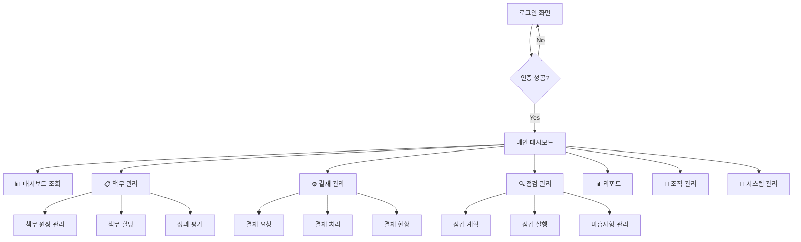
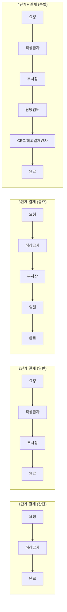
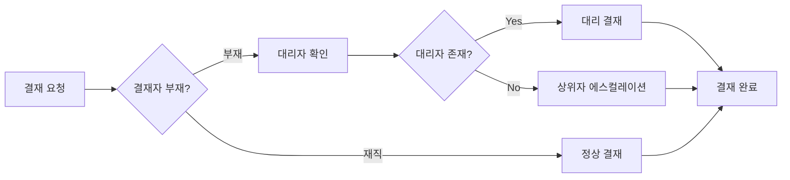
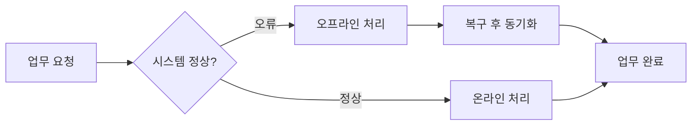
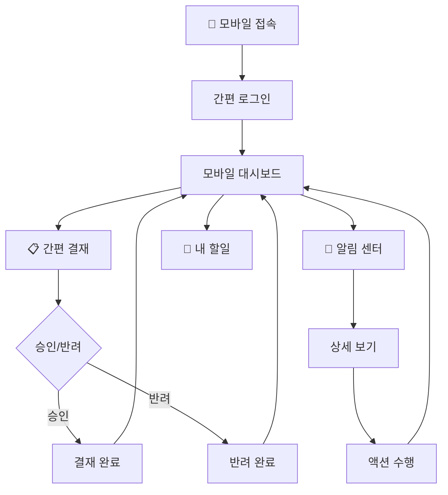

# RSMS 업무 프로세스 정의서

## 📋 개요

### 문서 정보
- **시스템명**: RSMS (Risk/Responsibility Management System)
- **문서명**: 업무 프로세스 정의서
- **작성일**: 2025-09-12
- **문서 버전**: 1.0
- **아키텍처**: Domain-Driven Design + Clean Architecture

### 목적
RSMS 시스템의 전체 업무 프로세스 흐름을 정의하여 사용자가 어느 화면에서 시작하여 어떤 업무를 처리하고, 결재가 필요한 단계와 프로세스 종료 지점을 명확히 하는 것

---

## 🎯 1. 전체 프로세스 개요

### 1.1 시스템 진입점 및 메인 프로세스 흐름



### 1.2 핵심 비즈니스 프로세스
1. **대시보드 모니터링**: 실시간 현황 파악 및 의사결정 지원
2. **책무 관리 프로세스**: 책무 등록 → 할당 → 이행 → 평가
3. **결재 워크플로우**: 결재 요청 → 결재선 생성 → 다단계 승인 → 완료
4. **점검 사이클**: 점검 계획 → 실행 → 결과 분석 → 개선 조치
5. **리포팅**: 자동 리포트 생성 및 배포

---

## 🚪 2. 시스템 진입 및 시작화면

### 2.1 로그인 프로세스
**시작점**: `/login` 로그인 화면

**프로세스 흐름**:
```
1. 사용자 접속 → 로그인 화면 표시
2. ID/PW 입력 → 인증 처리 (Spring Security)
3. 인증 성공 → 세션 생성 (Spring Session JDBC)
4. 권한 확인 → 메인 대시보드로 이동
5. 인증 실패 → 오류 메시지 표시 → 재입력 요구
```

**종료 조건**:
- ✅ 성공: 메인 대시보드 진입
- ❌ 실패: 로그인 화면 유지 (5회 실패 시 계정 잠금)

### 2.2 메인 대시보드 (시작 허브)
**위치**: `/dashboard` 메인 대시보드

**역할**: 모든 업무의 중앙 허브
- 개인별 맞춤 현황 표시
- 각 업무 영역으로의 진입점 제공
- 실시간 알림 및 할 일 목록 표시

---

## 📋 3. 책무 관리 프로세스

### 3.1 책무 원장 관리 프로세스

**시작화면**: `/resps/ledger` 책무 원장 관리

**업무 흐름**:
```
1. [시작] 책무 원장 관리 진입
2. 기존 책무 조회 또는 신규 등록 선택
3-A. 신규 등록 경로:
   3-A-1. 책무 기본 정보 입력
   3-A-2. 책무 상세 정보 작성
   3-A-3. 첨부 파일 업로드
   3-A-4. 임시저장 또는 등록 완료
   3-A-5. [결재 필요] 부서장 승인 요청
   3-A-6. 승인 완료 → 책무 활성화
3-B. 기존 수정 경로:
   3-B-1. 책무 검색 및 선택
   3-B-2. 수정 권한 확인
   3-B-3. 내용 수정
   3-B-4. [결재 필요] 변경 승인 요청
   3-B-5. 승인 완료 → 변경사항 적용
4. [종료] 책무 원장 업데이트 완료
```

**결재 지점**:
- ⚙️ 신규 책무 등록 → 부서장 승인 (1단계)
- ⚙️ 기존 책무 수정 → 부서장 승인 (1단계)
- ⚙️ 책무 삭제 → 부서장 + 상위부서장 승인 (2단계)

**종료 조건**:
- ✅ 등록/수정 승인 완료
- ✅ 임시저장 완료
- ❌ 승인 반려 → 수정 후 재제출

### 3.2 책무 할당 프로세스

**시작화면**: `/resps/assignment` 책무 할당

**업무 흐름**:
```
1. [시작] 책무 할당 화면 진입
2. 할당할 책무 선택 (원장에서 선택)
3. 할당 대상자 선택 (개인/부서/팀)
4. 할당 조건 설정:
   4-1. 수행 기간 설정
   4-2. 우선순위 지정
   4-3. 성과 목표 설정
   4-4. 평가 기준 정의
5. [결재 필요] 할당 승인 요청
   5-1. 피할당자의 직상급자 승인
   5-2. 책무 등록자 확인
6. 승인 완료 → 책무 할당 확정
7. 자동 알림 발송 (피할당자)
8. [종료] 할당 완료
```

**결재 지점**:
- ⚙️ 책무 할당 → 피할당자 직상급자 승인 (1단계)
- ⚙️ 중요 책무 할당 → 부서장 + 할당자 확인 (2단계)

**종료 조건**:
- ✅ 할당 승인 완료 및 알림 발송
- ❌ 할당 반려 → 할당 조건 재검토

### 3.3 성과 평가 프로세스

**시작화면**: `/resps/evaluation` 성과 평가

**업무 흐름**:
```
1. [시작] 성과 평가 진입
2. 평가 대상 선택 (개인/부서/기간별)
3. 평가 방식 선택:
   3-A. 자동 평가: 시스템 데이터 기반
   3-B. 수동 평가: 평가자 직접 입력
4. 평가 수행:
   4-1. 평가 지표별 점수 입력
   4-2. 정성 평가 의견 작성
   4-3. 증빙 자료 첨부
   4-4. 평가 결과 검토
5. [결재 필요] 평가 결과 승인
   5-1. 평가자의 상급자 검토
   5-2. HR 부서 최종 승인
6. 승인 완료 → 평가 결과 확정
7. [종료] 평가 완료 및 피드백 제공
```

**결재 지점**:
- ⚙️ 성과 평가 결과 → 상급자 검토 + HR 승인 (2단계)
- ⚙️ 평가 이의제기 → 평가위원회 재검토 (특별 프로세스)

---

## ⚙️ 4. 결재 관리 프로세스

### 4.1 결재 요청 프로세스

**시작화면**: `/approval/request` 결재 요청

**업무 흐름**:
```
1. [시작] 결재 요청 화면 진입
2. 결재 유형 선택 (책무, 구매, 인사, 기타)
3. 결재 문서 작성:
   3-1. 제목 및 내용 작성
   3-2. 첨부 파일 업로드
   3-3. 결재 금액 입력 (해당시)
   3-4. 긴급도 설정
4. 결재선 설정:
   4-1. 자동 결재선 생성 (규칙 기반)
   4-2. 결재선 수정 (권한 내에서)
   4-3. 병렬/순차 결재 방식 선택
5. 결재 요청 제출
6. [자동 프로세스] 결재 워크플로우 시작
7. [종료] 결재 요청 완료 → 결재 대기 상태
```

**자동 결재선 규칙**:
- 💰 금액별: ~100만원(1단계), ~500만원(2단계), 500만원+(3단계)
- 📋 업무별: 책무(2단계), 인사(3단계), 시스템(4단계)
- 🏢 조직별: 팀장 → 부서장 → 임원 순서

### 4.2 결재 처리 프로세스

**시작화면**: `/approval/inbox` 결재함

**업무 흐름**:
```
1. [시작] 결재함 진입 (대기 건수 표시)
2. 결재 대상 문서 선택
3. 문서 상세 내용 검토:
   3-1. 결재 요청 내용 확인
   3-2. 첨부 파일 검토
   3-3. 이전 단계 결재 의견 확인
4. 결재 판단:
   4-A. 승인 경로:
      4-A-1. 승인 의견 작성 (선택)
      4-A-2. 조건부 승인 설정 (선택)
      4-A-3. 승인 처리
   4-B. 반려 경로:
      4-B-1. 반려 사유 작성 (필수)
      4-B-2. 개선 방향 제시
      4-B-3. 반려 처리
   4-C. 보류 경로:
      4-C-1. 보류 사유 작성
      4-C-2. 추가 검토 일정 설정
5. 처리 완료 → 다음 단계로 자동 전달
6. [종료] 결재 처리 완료
```

**결재 처리 시간 기준**:
- ⏰ 일반 결재: 3일 이내
- 🚨 긴급 결재: 1일 이내
- ⚠️ 지연 시 자동 독촉 발송

### 4.3 결재 현황 모니터링

**시작화면**: `/approval/status` 결재 현황

**업무 흐름**:
```
1. [시작] 결재 현황 조회
2. 현황 유형 선택:
   2-A. 내가 요청한 결재
   2-B. 내가 처리한 결재
   2-C. 부서 전체 결재 현황
3. 필터 조건 설정 (기간, 상태, 유형)
4. 현황 조회 및 분석
5. 필요시 액션 수행:
   5-A. 지연 결재 독촉
   5-B. 결재 취소 요청
   5-C. 결재선 변경 요청
6. [종료] 현황 파악 완료
```

---

## 🔍 5. 점검 관리 프로세스

### 5.1 점검 계획 수립 프로세스

**시작화면**: `/inspection/planning` 점검 계획

**업무 흐름**:
```
1. [시작] 점검 계획 화면 진입
2. 점검 유형 선택 (정기, 특별, 추적)
3. 점검 계획 수립:
   3-1. 점검 대상 선정 (부서/개인/업무)
   3-2. 점검 범위 및 기준 설정
   3-3. 점검 일정 수립
   3-4. 점검팀 구성
   3-5. 점검 체크리스트 작성
4. [결재 필요] 점검 계획 승인
   4-1. 점검 담당자 검토
   4-2. 점검 총괄 부서장 승인
5. 승인 완료 → 점검 계획 확정
6. 점검 대상자 사전 공지
7. [종료] 점검 계획 수립 완료
```

**결재 지점**:
- ⚙️ 정기 점검 계획 → 점검 부서장 승인 (1단계)
- ⚙️ 특별 점검 계획 → 점검 부서장 + 담당 임원 승인 (2단계)

### 5.2 점검 실행 프로세스

**시작화면**: `/inspection/execution` 점검 실행

**업무 흐름**:
```
1. [시작] 점검 실행 진입
2. 점검 계획 선택 및 확인
3. 점검 수행:
   3-1. 체크리스트 기반 점검
   3-2. 증빙 자료 수집 및 검증
   3-3. 인터뷰 실시
   3-4. 현장 확인 (사진/동영상 기록)
4. 점검 결과 기록:
   4-1. 항목별 점검 결과 입력
   4-2. 미흡사항 상세 기록
   4-3. 우수사항 및 개선점 기록
   4-4. 종합 의견 작성
5. [결재 필요] 점검 결과 검토
   5-1. 점검팀장 1차 검토
   5-2. 점검 부서장 최종 승인
6. 승인 완료 → 점검 결과 확정
7. [종료] 점검 실행 완료
```

### 5.3 미흡사항 관리 프로세스

**시작화면**: `/inspection/improvement` 미흡사항 관리

**업무 흐름**:
```
1. [시작] 미흡사항 관리 진입
2. 미흡사항 등록:
   2-1. 점검 결과에서 자동 생성
   2-2. 미흡사항 분류 (경미, 보통, 심각, 치명적)
   2-3. 근본 원인 분석 수행
3. 개선 계획 수립:
   3-1. 개선 목표 및 완료 기준 설정
   3-2. 개선 담당자 지정
   3-3. 개선 일정 및 마일스톤 설정
   3-4. 개선 방법 및 절차 정의
4. [결재 필요] 개선 계획 승인
   4-1. 개선 담당자 상급자 검토
   4-2. 점검 부서 승인
5. 개선 활동 수행 및 모니터링
6. 개선 완료 검증
7. [결재 필요] 개선 완료 승인
8. [종료] 미흡사항 해결 완료
```

---

## 📊 6. 대시보드 및 리포팅 프로세스

### 6.1 실시간 대시보드 모니터링

**시작화면**: `/dashboard` 실시간 대시보드

**업무 흐름**:
```
1. [시작] 대시보드 접속 (실시간 자동 갱신)
2. 대시보드 유형 선택:
   2-A. 임원용 종합 대시보드
   2-B. 부서별 성과 대시보드
   2-C. 개인별 업무 대시보드
3. 실시간 모니터링:
   3-1. KPI 지표 확인
   3-2. 알림 및 이벤트 처리
   3-3. 드릴다운 분석 (상세 조회)
4. 필요시 액션:
   4-A. 관련 업무 화면으로 이동
   4-B. 알림 설정 변경
   4-C. 위젯 레이아웃 조정
5. [종료] 모니터링 완료 (상시 운영)
```

**자동 갱신 주기**:
- 🔄 KPI 데이터: 5분마다
- ⚡ 알림 데이터: 실시간
- 📊 차트 데이터: 15분마다

### 6.2 리포트 생성 및 배포

**시작화면**: `/reports/generate` 리포트 생성

**업무 흐름**:
```
1. [시작] 리포트 생성 진입
2. 리포트 유형 선택:
   2-A. 정기 리포트 (자동)
   2-B. 맞춤형 리포트 (수동)
3-A. 자동 리포트 경로:
   3-A-1. 기설정된 템플릿 확인
   3-A-2. 데이터 자동 수집 및 분석
   3-A-3. 리포트 자동 생성
3-B. 수동 리포트 경로:
   3-B-1. 리포트 조건 설정
   3-B-2. 데이터 범위 선택
   3-B-3. 분석 옵션 설정
   3-B-4. 사용자 정의 리포트 생성
4. 리포트 검토 및 편집
5. [선택적 결재] 중요 리포트 승인
6. 리포트 배포:
   6-1. 이메일 자동 발송
   6-2. 시스템 내 공유
   6-3. 외부 시스템 연동
7. [종료] 리포트 배포 완료
```

---

## 👥 7. 조직 및 시스템 관리 프로세스

### 7.1 사용자 관리 프로세스

**시작화면**: `/admin/users` 사용자 관리

**업무 흐름**:
```
1. [시작] 사용자 관리 진입 (관리자 권한 필요)
2. 관리 작업 선택:
   2-A. 신규 사용자 등록
   2-B. 기존 사용자 정보 수정
   2-C. 사용자 권한 변경
   2-D. 계정 상태 관리 (활성/비활성)
3. 사용자 정보 처리:
   3-1. 기본 정보 입력/수정
   3-2. 조직 정보 설정
   3-3. 역할 및 권한 부여
   3-4. 시스템 접근 권한 설정
4. [결재 필요] 사용자 관리 승인
   4-1. 신규 등록: HR 부서 + IT 관리자 승인 (2단계)
   4-2. 권한 변경: 해당 부서장 + 보안 관리자 승인 (2단계)
5. 승인 완료 → 변경사항 적용
6. 대상자 알림 발송
7. [종료] 사용자 관리 완료
```

### 7.2 시스템 설정 관리

**시작화면**: `/admin/system` 시스템 관리

**업무 흐름**:
```
1. [시작] 시스템 관리 진입 (최고 관리자 권한)
2. 관리 영역 선택:
   2-A. 코드 관리 (공통 코드, 메뉴 설정)
   2-B. 결재선 템플릿 관리
   2-C. 알림 설정 관리
   2-D. 시스템 파라미터 설정
3. 설정 변경 작업 수행
4. [결재 필요] 중요 설정 변경 승인
   4-1. IT 관리자 검토
   4-2. 시스템 총괄 승인
5. 변경사항 적용 및 배포
6. 시스템 재시작 (필요시)
7. [종료] 시스템 설정 완료
```

---

## 🔄 8. 프로세스 종료 조건 및 예외 처리

### 8.1 정상 종료 조건

**프로세스별 정상 종료 조건**:

| 프로세스 영역 | 정상 종료 조건 |
|--------------|--------------|
| **책무 관리** | ✅ 책무 등록/할당 완료, 성과 평가 확정 |
| **결재 워크플로우** | ✅ 최종 결재 완료 또는 결재 취소 처리 |
| **점검 관리** | ✅ 점검 완료, 미흡사항 개선 완료 승인 |
| **리포팅** | ✅ 리포트 생성 및 배포 완료 |
| **시스템 관리** | ✅ 설정 변경 적용 및 시스템 안정화 |

### 8.2 예외 처리 및 복구 프로세스

**주요 예외 상황**:

1. **결재자 부재 시**:
   ```
   결재 지연 감지 → 대리자 자동 지정 → 에스컬레이션 → 긴급 승인
   ```

2. **시스템 오류 시**:
   ```
   오류 감지 → 자동 복구 시도 → 관리자 알림 → 수동 복구 → 서비스 재개
   ```

3. **데이터 불일치 시**:
   ```
   불일치 감지 → 데이터 검증 → 백업 복구 → 재처리 → 정합성 확인
   ```

### 8.3 프로세스 모니터링 및 개선

**상시 모니터링 지표**:
- 📊 프로세스 완료율: 95% 이상 목표
- ⏱️ 평균 처리 시간: 각 프로세스별 기준 시간 내
- 🚨 예외 발생율: 5% 이하 유지
- 💡 사용자 만족도: 85점 이상

**개선 프로세스**:
```
성능 지표 모니터링 → 병목 구간 식별 → 개선 방안 도출 → 
결재 승인 → 개선 적용 → 효과 측정 → 지속적 개선
```

---

## 🗺️ 9. 전체 업무 흐름도 및 화면 연결성

### 9.1 통합 업무 흐름도

```mermaid
graph TB
    Start([사용자 접속]) --> Login[/login - 로그인]
    Login --> Auth{인증 성공?}
    Auth -->|실패| Login
    Auth -->|성공| Dashboard[/dashboard - 메인 대시보드]
    
    Dashboard --> Menu{메뉴 선택}
    
    Menu --> Resp[📋 책무 관리]
    Menu --> Approval[⚙️ 결재 관리]  
    Menu --> Inspection[🔍 점검 관리]
    Menu --> Report[📊 리포트]
    Menu --> Admin[👥 관리자]
    
    %% 책무 관리 흐름
    Resp --> RespLedger[/resps/ledger<br/>책무 원장 관리]
    Resp --> RespAssign[/resps/assignment<br/>책무 할당]
    Resp --> RespEval[/resps/evaluation<br/>성과 평가]
    
    RespLedger --> RespApproval1{부서장 승인}
    RespAssign --> RespApproval2{상급자 승인}
    RespEval --> RespApproval3{HR 승인}
    
    RespApproval1 -->|승인| RespComplete1[책무 등록 완료]
    RespApproval2 -->|승인| RespComplete2[할당 완료]
    RespApproval3 -->|승인| RespComplete3[평가 완료]
    
    %% 결재 관리 흐름
    Approval --> ApprovalReq[/approval/request<br/>결재 요청]
    Approval --> ApprovalInbox[/approval/inbox<br/>결재함]
    Approval --> ApprovalStatus[/approval/status<br/>결재 현황]
    
    ApprovalReq --> ApprovalLine[결재선 설정]
    ApprovalLine --> ApprovalFlow[다단계 결재 진행]
    ApprovalInbox --> ApprovalProcess[결재 처리]
    ApprovalProcess --> ApprovalDecision{승인/반려}
    ApprovalDecision -->|승인| NextStep[다음 단계]
    ApprovalDecision -->|반려| ApprovalReject[반려 처리]
    ApprovalDecision -->|보류| ApprovalHold[보류 처리]
    
    NextStep --> FinalApproval{최종 단계?}
    FinalApproval -->|Yes| ApprovalComplete[결재 완료]
    FinalApproval -->|No| ApprovalFlow
    
    %% 점검 관리 흐름
    Inspection --> InspPlan[/inspection/planning<br/>점검 계획]
    Inspection --> InspExec[/inspection/execution<br/>점검 실행]
    Inspection --> InspImprove[/inspection/improvement<br/>미흡사항 관리]
    
    InspPlan --> InspApproval1{점검 계획 승인}
    InspApproval1 -->|승인| InspExec
    InspExec --> InspResult[점검 결과 기록]
    InspResult --> InspApproval2{결과 승인}
    InspApproval2 -->|승인| InspImprove
    InspImprove --> ImprovePlan[개선 계획 수립]
    ImprovePlan --> ImproveApproval{개선 계획 승인}
    ImproveApproval -->|승인| ImproveExec[개선 실행]
    ImproveExec --> ImproveComplete[개선 완료]
    
    %% 완료 후 대시보드 복귀
    RespComplete1 --> Dashboard
    RespComplete2 --> Dashboard
    RespComplete3 --> Dashboard
    ApprovalComplete --> Dashboard
    ApprovalReject --> Dashboard
    ImproveComplete --> Dashboard
    
    %% 리포트 흐름
    Report --> ReportGen[/reports/generate<br/>리포트 생성]
    ReportGen --> ReportType{리포트 유형}
    ReportType -->|자동| AutoReport[자동 리포트 생성]
    ReportType -->|수동| ManualReport[맞춤형 리포트]
    AutoReport --> ReportDist[리포트 배포]
    ManualReport --> ReportReview[리포트 검토]
    ReportReview --> ReportApproval{중요 리포트 승인}
    ReportApproval -->|승인| ReportDist
    ReportDist --> Dashboard
```

### 9.2 화면별 연결성 매트릭스

| 시작 화면 | 연결 화면 | 연결 조건 | 결재 필요 | 종료점 |
|-----------|-----------|-----------|----------|--------|
| `/login` | `/dashboard` | 인증 성공 | ❌ | 대시보드 |
| `/dashboard` | `/resps/*` | 권한 확인 | - | - |
| `/dashboard` | `/approval/*` | 권한 확인 | - | - |
| `/dashboard` | `/inspection/*` | 권한 확인 | - | - |
| `/resps/ledger` | `/approval/request` | 등록/수정시 | ✅ | 승인 완료 |
| `/resps/assignment` | `/approval/request` | 할당시 | ✅ | 할당 완료 |
| `/resps/evaluation` | `/approval/request` | 평가시 | ✅ | 평가 완료 |
| `/approval/request` | `/approval/inbox` | 결재선 생성 | - | - |
| `/approval/inbox` | `/approval/status` | 처리 후 | - | 결재 완료 |
| `/inspection/planning` | `/approval/request` | 계획 수립시 | ✅ | 계획 승인 |
| `/inspection/execution` | `/inspection/improvement` | 미흡사항 발견시 | - | - |
| `/inspection/improvement` | `/approval/request` | 개선 계획시 | ✅ | 개선 완료 |
| `/reports/generate` | `/approval/request` | 중요 리포트 | ⚙️ | 배포 완료 |

### 9.3 결재 지점별 상세 플로우



### 9.4 예외 상황별 대체 플로우

**1. 결재자 부재 시**


**2. 시스템 오류 시**


### 9.5 모바일 접근 플로우

**모바일 최적화 화면 연결**:



---

## 📈 10. 프로세스 성과 관리

### 10.1 핵심 성과 지표 (KPI)

**업무별 핵심 지표**:

| 업무 영역 | 주요 KPI | 목표치 |
|----------|----------|---------|
| **책무 관리** | 책무 이행률, 평가 완료율 | 90% 이상 |
| **결재 관리** | 결재 처리 시간, 지연율 | 평균 2일, 5% 이하 |
| **점검 관리** | 점검 완료율, 개선율 | 100%, 95% 이상 |
| **시스템 가용성** | 시스템 uptime, 응답시간 | 99.9%, 3초 이내 |

### 10.2 지속적 개선 체계

**개선 사이클**: Plan → Do → Check → Act (PDCA)

1. **Plan (계획)**: 프로세스 분석 및 개선 계획 수립
2. **Do (실행)**: 개선 방안 시범 적용
3. **Check (확인)**: 개선 효과 측정 및 평가
4. **Act (조치)**: 성공적 개선안 전사 적용

---

## 🎯 11. 결론

### 11.1 프로세스 특징 요약

**RSMS 프로세스의 핵심 특징**:
- 🔄 **순환적 구조**: 대시보드 → 업무 → 결재 → 완료 → 대시보드
- ⚙️ **다단계 결재**: 업무 중요도와 금액에 따른 차별적 결재선
- 🔍 **실시간 모니터링**: 전 프로세스 실시간 현황 파악 가능
- 🤖 **자동화**: 결재선 생성, 알림 발송, 리포트 생성 자동화
- 📊 **데이터 기반**: 모든 의사결정을 데이터와 지표로 뒷받침

### 11.2 성공적 프로세스 운영을 위한 요구사항

**기술적 요구사항**:
- React 18 + Spring Boot 3.3.5 기반 안정적 플랫폼
- PostgreSQL + Spring Session JDBC 기반 세션 관리
- 실시간 알림 및 모니터링 시스템

**운영적 요구사항**:
- 명확한 권한 체계 및 역할 정의
- 표준화된 업무 절차 및 가이드라인
- 지속적 교육 및 변화 관리

**조직적 요구사항**:
- 경영진의 강력한 지원 및 리더십
- 변화에 대한 조직 구성원의 수용성
- 데이터 기반 의사결정 문화 정착

---

**📅 작성일**: 2025-09-12  
**✍️ 작성자**: Claude AI (RSMS 프로세스 정의서)  
**🔄 버전**: 1.0  
**📋 상태**: 초안 완성