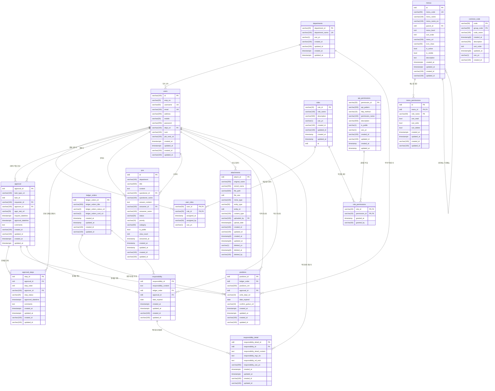

# 프로젝트 데이터베이스 ER 다이어그램

## 개요
이 문서는 프로젝트의 데이터베이스 구조와 테이블 간의 관계를 Mermaid 다이어그램으로 표현한 것입니다.

## 데이터베이스 구조도

## 주요 테이블 그룹별 설명

### 1. 사용자 및 인증 관리
- **users**: 사용자 기본 정보 (사번, 이름, 이메일, 부서 등)
- **departments**: 부서 정보
- **roles**: 역할 정의
- **user_roles**: 사용자별 역할 할당 (다대다 관계)
- **api_permissions**: API 권한 정의
- **role_permissions**: 역할별 권한 할당

### 2. 메뉴 및 UI 권한
- **menus**: 메뉴 구조 (계층형 구조 지원)
- **menu_permissions**: 메뉴별 역할 권한

### 3. 원장 및 직책 관리
- **ledger_orders**: 원장 차수 관리
- **positions**: 직책 정보 (원장 차수별)

### 4. 결재 시스템
- **approval**: 결재 기본 정보
- **approval_steps**: 결재 단계별 상세 정보

### 5. 책무 관리
- **responsibility**: 책무 기본 정보
- **responsibility_detail**: 책무 상세 내용

### 6. 공통 및 기타
- **common_code**: 공통 코드 관리
- **qna**: 문의 및 답변
- **attachments**: 범용 첨부파일 관리

## 설계 특징

1. **역할 기반 접근 제어 (RBAC)**: 사용자-역할-권한의 3계층 구조
2. **계층형 메뉴 구조**: 상위-하위 메뉴 관계 지원
3. **유연한 결재 시스템**: 다단계 결재 및 단계별 상태 관리
4. **범용 첨부파일**: entity_type과 entity_id를 통한 다양한 업무 연결
5. **감사 추적**: 모든 테이블에 생성자/수정자/생성일시/수정일시 정보 포함
6. **논리적 삭제**: attachments 테이블의 deleted_yn을 통한 논리적 삭제 지원

## 인덱스 전략

- **성능 최적화**: 자주 조회되는 컬럼에 대한 인덱스 설정
- **복합 인덱스**: entity_type + entity_id와 같은 복합 인덱스 활용
- **부분 인덱스**: deleted_yn = 'N' 조건의 부분 인덱스 사용

